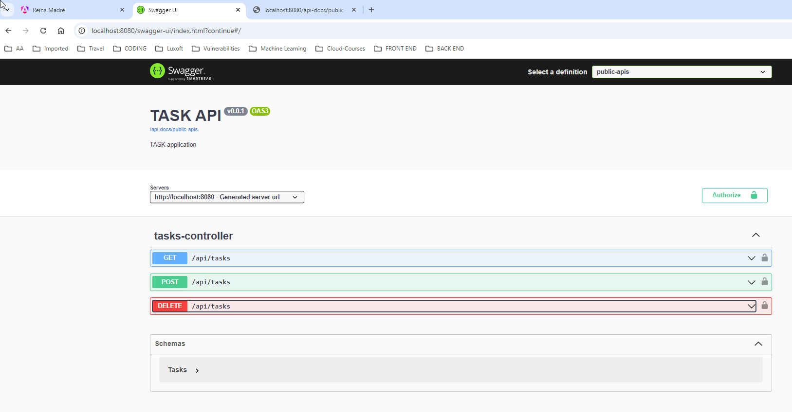

TIERRA MADRE APP

Full-stack Angular 17 + Spring Boot Tutorial CRUD Application in that:
- Each Task has id, title, description, published status and priority.
- We can create, retrieve, update, delete Tasks.
- We can also find Tasks by status and priority.

## Reina Madre APP


Swagger_UI



## Run Spring Boot application 
```
mvn spring-boot:run
```
The Spring Boot Server will export API at port `8081`.

## Run Angular Client
```
npm install
ng serve --port 8081
```
